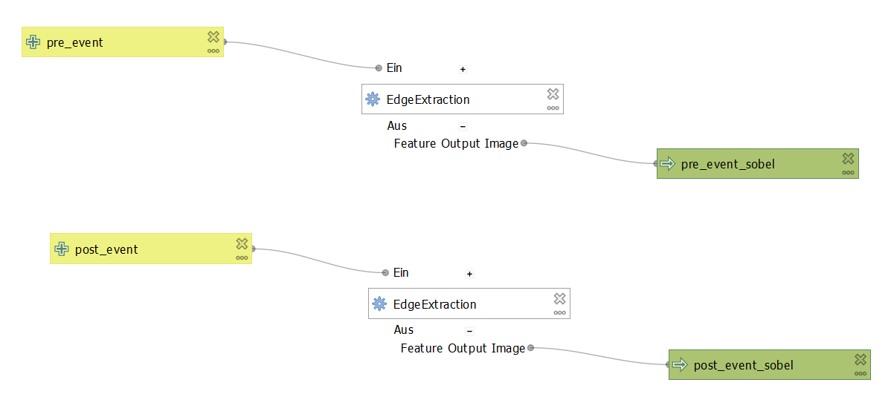

# Edge Detection

## Introduction

Changes in detected edges in pre-event and post-event imagery could indicate collapsed structures, to test this apporach a Sobel operator was applied to the multichromatic images. A brief QGIS workflow is also included in this directory.

## Workflow and Results

We have chosen the Sobel operator for the edge detection. In addition, a threshold could be applied to the results.

*Processing graph for the edge detection workflow*

It can be seen that in the case of collapsed walls, the detected edges are less pronounced in the image after the event, which could be used to extract destroyed buildings. However, the filter also highlights drop shadows, which must be distinguished from edges originating from buildings. The comparison of the detected edges from the pre-event and post-event images is complicated by the slightly inaccurate georeferencing of the pre-event image and the oblique viewing angle of the post-event imagery.

## Discussion

Due to the limitations mentioned above, edge detection, also in combination with an object-based approach, is not sufficient for the automatic detection of collapsed buildings for the avaiable imagery.
